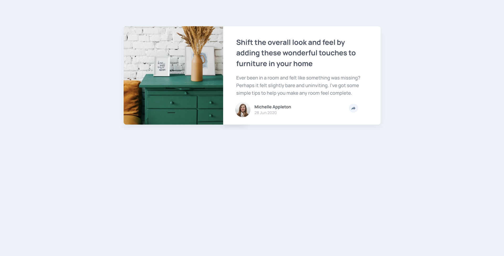
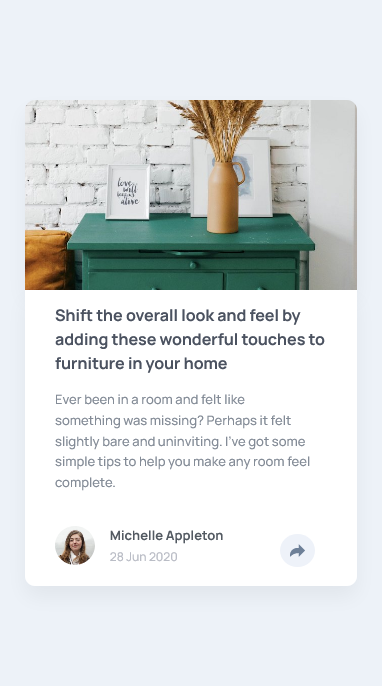

# Frontend Mentor - Article preview component solution

This is a solution to the [Article preview component](https://www.frontendmentor.io/challenges/article-preview-component-dYBN_pYFT/). Frontend Mentor challenges help you improve your coding skills by building realistic projects. 

## Table of contents

- [Overview](#overview)
  - [Built with](#built-with)
- [Author](#author)

## Overview

- Live Site URL: [Article preview component](https://frontendmentor-newbie.github.io/06.article-preview-component/)

- Solution: [Frontendmentor.io](https://www.frontendmentor.io/solutions/article-preview-component-htmlcssjs-hIa7vdey2)
- Challenge: [Hub](https://www.frontendmentor.io/challenges/article-preview-component-dYBN_pYFT/)

### Built with

- Semantic HTML5 markup
- CSS custom properties
- Grid
- Flexbox
- Mobile-first workflow

## Author
- Frontend Mentor - [@Nahuel-P](https://www.frontendmentor.io/profile/Nahuel-P)
- Twitter - [@Nahuel__P](https://twitter.com/Nahuel__P)

